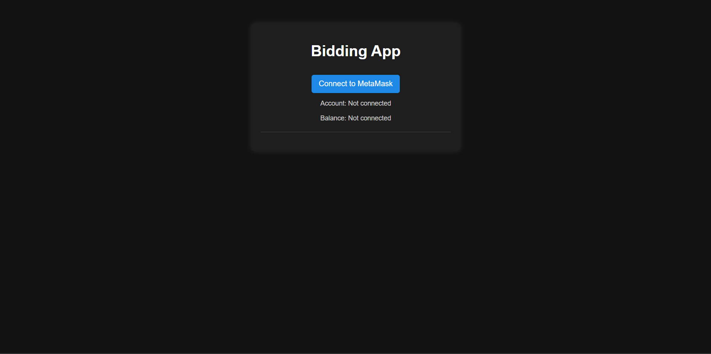
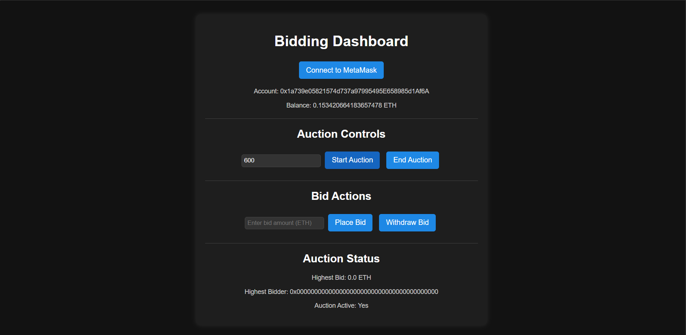

# Blockchain Auction System
A blockchain-powered auction system built with Solidity, the programming language for the Ethereum blockchain. This project enables users to create and engage in auctions within a decentralized framework, ensuring security, fairness, and transparency throughout the process.

## Features
- Decentralized Auction Process: Conducts auctions on a blockchain network, eliminating intermediaries and ensuring full transparency.
- Real-Time Bidding: Users can submit bids dynamically, with the highest bid at the auction's conclusion determining the winner.
- Defined Auction Timeline: Auctions operate within predetermined start and end times to maintain fairness and structure.
- Automated Fund Transactions: The smart contract securely processes payments, automatically transferring funds to the seller after the auction closes.

## Technologies Used
- Backend: Solidity (Auction.sol smart contract), Ethereum blockchain
- Frontend: JavaScript, HTML, CSS
- Other Technologies: Remix IDE, MetaMask for wallet integration

## Screenshots
### Home Page

### Bidding Dashboard

